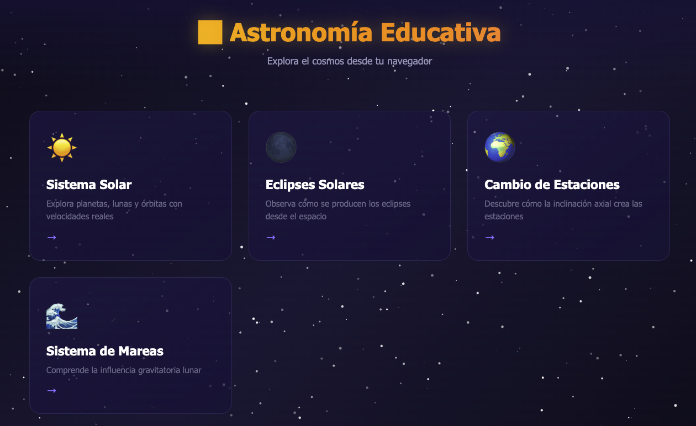
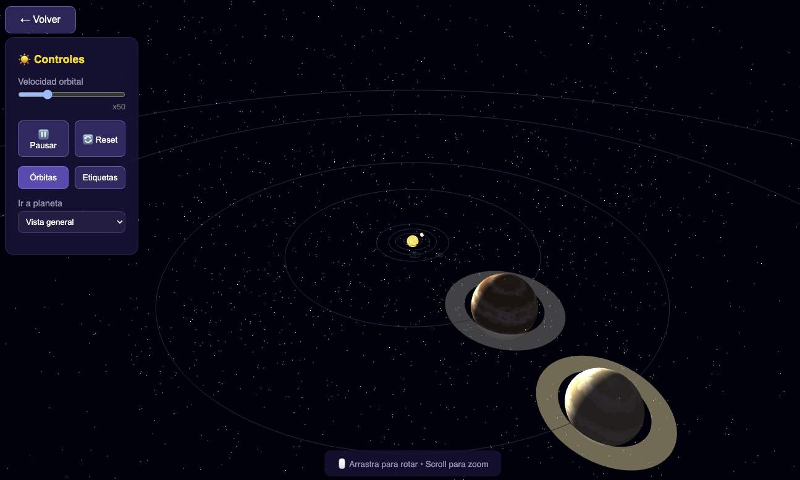
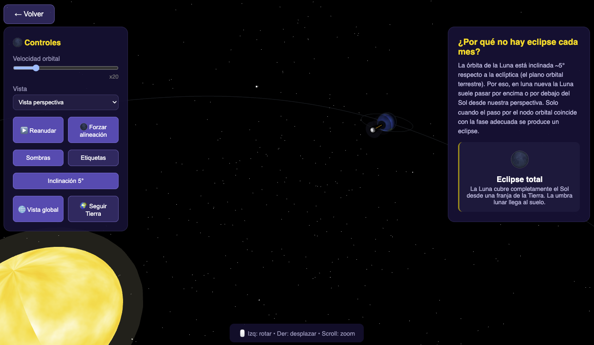

# 🌌 Astronomía Educativa

Plataforma web educativa e interactiva para la enseñanza de conceptos fundamentales de astronomía mediante simulaciones visuales en 3D.

## Características

### ☀️ Sistema Solar
- Visualización interactiva del Sistema Solar.
- Representación de planetas y principales satélites.
- Órbitas con inclinaciones realistas.
- Control de velocidad de simulación.
- Escalas proporcionales para comprender las relaciones entre cuerpos celestes.

### 🌑 Eclipses Solares
- Simulación visual del movimiento Sol-Tierra-Luna.
- Demostración de la formación de eclipses solares.
- Visualización de la sombra proyectada por la Luna sobre la Tierra.

### 🌍 Cambio de Estaciones
- Representación de la órbita terrestre.
- Visualización de la inclinación axial de la Tierra.
- Explicación gráfica del origen de las estaciones.

### 🌊 Sistema de Mareas
- Simulación de la influencia gravitatoria lunar.
- Explicación visual de las mareas.
- Relación entre posiciones orbitales y variaciones del nivel del mar.

---

## Tecnologías utilizadas

- HTML5
- CSS3
- JavaScript ES6
- Three.js

---

## Capturas de pantalla

### Home



### Sistema Solar



### Eclipses



---

## Instalación

Clona el repositorio:

```bash
git clone https://github.com/TU_USUARIO/astronomia-educativa.git
cd astronomia-educativa
```

Ejecuta un servidor web local:

### Python

```bash
python3 -m http.server 8000
```

Después abre:

```text
http://localhost:8000
```

---

## Estructura del proyecto

```text
astronomia-educativa/
├── index.html
├── static/
│   ├── css/
│   │   └── styles.css
│   ├── js/
│   │   ├── main.js
│   │   ├── modules/
│   │   │   ├── sistema-solar.html
│   │   │   ├── eclipses.html
│   │   │   ├── estaciones.html
│   │   │   └── mareas.html
│   │   └── utils/
│   └── textures/
└── README.md
```

---

## Objetivo educativo

Este proyecto busca facilitar la comprensión de fenómenos astronómicos mediante simulaciones interactivas accesibles desde cualquier navegador moderno.

Está orientado a:

- Educación primaria y secundaria.
- Divulgación científica.
- Aprendizaje autodidacta.
- Apoyo a docentes.

---

## Contribuciones

Las contribuciones son bienvenidas.

1. Haz un fork del proyecto.
2. Crea una rama:

```bash
git checkout -b nueva-funcionalidad
```

3. Realiza tus cambios.
4. Envía un Pull Request.

---

## Licencia

Este proyecto está distribuido bajo la licencia GNU GPL v3.0.

Consulta el archivo [LICENSE](LICENSE) para más información.

